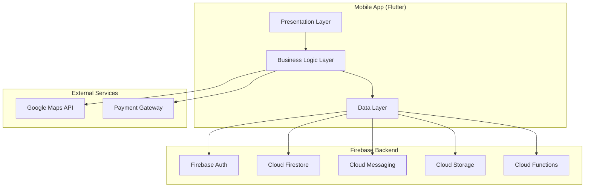

# Taxi Dispatch App - Design Document

## Overview

The Taxi Dispatch App is a Flutter-based mobile application that connects taxi drivers with company owners through real-time ride matching, GPS tracking, and automated notifications. The app uses a clean architecture pattern with clear separation between presentation, business logic, and data layers.

### Technology Stack

- **Frontend**: Flutter (Dart) for cross-platform mobile development (iOS & Android)
- **State Management**: Riverpod for reactive state management
- **Backend**: Firebase (Firestore, Authentication, Cloud Functions, Cloud Storage)
- **Real-Time Database**: Cloud Firestore with real-time listeners
- **Maps**: Google Maps Flutter plugin
- **Notifications**: Firebase Cloud Messaging (FCM)
- **Storage**: Firebase Cloud Storage for photos and documents
- **Authentication**: Firebase Authentication

## Architecture

### High-Level Architecture



### Clean Architecture Layers

1. **Presentation Layer** (UI)
   - Screens and widgets
   - View models (Riverpod providers)
   - UI state management

2. **Business Logic Layer** (Domain)
   - Use cases / interactors
   - Business rules
   - Domain models

3. **Data Layer**
   - Repositories (abstract interfaces)
   - Data sources (Firebase, local storage)
   - DTOs and mappers

## Components and Interfaces

### 1. Authentication Module

#### Components
- `AuthRepository`: Interface for authentication operations
- `FirebaseAuthDataSource`: Firebase Authentication implementation
- `AuthService`: Business logic for login, registration, verification
- `LoginScreen`, `RegistrationScreen`, `RoleSelectionScreen`: UI components

#### Key Interfaces

```dart
abstract class AuthRepository {
  Future<User> login(String email, String password);
  Future<User> registerDriver(DriverRegistrationData data);
  Future<User> registerCompany(CompanyRegistrationData data);
  Future<void> sendEmailVerification();
  Future<void> sendPhoneVerification(String phoneNumber);
  Future<bool> verifyOTP(String otp);
  Future<void> logout();
  Stream<User?> get authStateChanges;
}
```

### 2. User Profile Module

#### Components
- `UserRepository`: Interface for user data operations
- `FirestoreUserDataSource`: Firestore implementation
- `ProfileService`: Business logic for profile management
- `DriverProfileScreen`, `CompanyProfileScreen`, `SettingsScreen`: UI components

#### Firestore Collections

```
users/
  {userId}/
    - type: "driver" | "company"
    - email: string
    - phoneNumber: string
    - fullName: string
    - profilePhotoUrl: string
    - createdAt: timestamp
    - updatedAt: timestamp
    
    // Driver-specific fields
    - vehicleInfo: {
        make: string,
        model: string,
        licensePlate: string,
        color: string,
        year: number
      }
    - driverLicenseNumber: string
    - driverLicensePhotoUrl: string
    - availabilityStatus: "available" | "busy" | "offline"
    - currentLocation: GeoPoint
    - averageRating: number
    - totalRides: number
    
    // Company-specific fields
    - companyName: string
    - companyRegistrationNumber: string
    - businessAddress: string
```

### 3. Ride Management Module

#### Components
- `RideRepository`: Interface for ride operations
- `FirestoreRideDataSource`: Firestore implementation
- `RideService`: Business logic for ride lifecycle
- `RideRequestScreen`, `ActiveRideScreen`, `RideHistoryScreen`: UI components

#### Key Interfaces

```dart
abstract class RideRepository {
  Future<Ride> createRideRequest(RideRequest request);
  Future<void> acceptRide(String rideId, String driverId);
  Future<void> updateRideStatus(String rideId, RideStatus status);
  Future<void> completeRide(String rideId);
  Stream<Ride?> watchActiveRide(String userId);
  Future<List<Ride>> getRideHistory(String userId);
  Future<List<Driver>> findAvailableDrivers(GeoPoint location, double radiusKm);
}
```

#### Firestore Collections

```
rides/
  {rideId}/
    - companyUserId: string
    - driverUserId: string | null
    - status: "pending" | "accepted" | "enroute" | "arrived" | "completed" | "cancelled"
    - pickupLocation: GeoPoint
    - pickupAddress: string
    - destination: GeoPoint | null
    - destinationAddress: string | null
    - requestedAt: timestamp
    - acceptedAt: timestamp | null
    - arrivedAt: timestamp | null
    - completedAt: timestamp | null
    - fare: number | null
    - distance: number | null
    - duration: number | null
    - rating: {
        driverRating: number | null,
        companyRating: number | null,
        driverFeedback: string | null,
        companyFeedback: string | null
      }
```

### 4. Real-Time Tracking Module

#### Components
- `LocationRepository`: Interface for location operations
- `LocationService`: GPS location tracking
- `MapService`: Google Maps integration
- `TrackingScreen`, `MapWidget`: UI components

#### Key Interfaces

```dart
abstract class LocationRepository {
  Stream<Position> watchDriverLocation(String driverId);
  Future<void> updateDriverLocation(String driverId, Position position);
  Future<double> calculateDistance(GeoPoint start, GeoPoint end);
  Future<Duration> calculateETA(GeoPoint start, GeoPoint end);
  Future<List<LatLng>> getRoute(GeoPoint start, GeoPoint end);
}
```

#### Implementation Details

- Use `geolocator` package for GPS tracking
- Update driver location every 10-30 seconds when ride is active
- Use Firestore GeoPoint for location storage
- Implement geohashing for efficient proximity queries (5km radius)
- Use Google Maps Directions API for route calculation and ETA

### 5. Notification Module

#### Components
- `NotificationRepository`: Interface for notification operations
- `FCMNotificationDataSource`: Firebase Cloud Messaging implementation
- `NotificationService`: Business logic for notifications
- Cloud Functions for server-side notification triggers

#### Key Interfaces

```dart
abstract class NotificationRepository {
  Future<void> initializeNotifications();
  Future<String> getDeviceToken();
  Future<void> subscribeToTopic(String topic);
  Future<void> sendNotification(String userId, NotificationData data);
  Stream<RemoteMessage> get onMessageReceived;
}
```

#### Cloud Functions

```javascript
// Trigger when ride is created
exports.onRideCreated = functions.firestore
  .document('rides/{rideId}')
  .onCreate(async (snap, context) => {
    // Find available drivers within 5km
    // Send FCM notifications to all eligible drivers
  });

// Trigger when ride is accepted
exports.onRideAccepted = functions.firestore
  .document('rides/{rideId}')
  .onUpdate(async (change, context) => {
    // Cancel notifications to other drivers
    // Notify company user of acceptance
  });
```

### 6. Payment Module

#### Components
- `PaymentRepository`: Interface for payment operations
- `StripePaymentDataSource`: Payment gateway implementation
- `PaymentService`: Business logic for transactions
- `PaymentScreen`, `TransactionHistoryScreen`: UI components

#### Key Interfaces

```dart
abstract class PaymentRepository {
  Future<void> addPaymentMethod(PaymentMethod method);
  Future<List<PaymentMethod>> getPaymentMethods(String userId);
  Future<Payment> processPayment(String rideId, double amount);
  Future<Receipt> generateReceipt(String paymentId);
  Future<List<Transaction>> getTransactionHistory(String userId);
}
```

### 7. Rating and Review Module

#### Components
- `RatingRepository`: Interface for rating operations
- `FirestoreRatingDataSource`: Firestore implementation
- `RatingService`: Business logic for ratings
- `RatingScreen`: UI component

#### Key Interfaces

```dart
abstract class RatingRepository {
  Future<void> submitRating(String rideId, Rating rating);
  Future<double> calculateAverageRating(String userId);
  Future<List<Review>> getReviews(String userId);
}
```

### 8. Chat Module

#### Components
- `ChatRepository`: Interface for messaging operations
- `FirestoreChatDataSource`: Firestore implementation
- `ChatService`: Business logic for messaging
- `ChatScreen`: UI component

#### Firestore Collections

```
chats/
  {rideId}/
    messages/
      {messageId}/
        - senderId: string
        - receiverId: string
        - message: string
        - timestamp: timestamp
        - read: boolean
```

## Data Models

### Core Domain Models

```dart
// User Models
class User {
  final String id;
  final UserType type;
  final String email;
  final String phoneNumber;
  final String fullName;
  final String? profilePhotoUrl;
}

class Driver extends User {
  final VehicleInfo vehicleInfo;
  final String driverLicenseNumber;
  final String? driverLicensePhotoUrl;
  final AvailabilityStatus availabilityStatus;
  final GeoPoint? currentLocation;
  final double averageRating;
  final int totalRides;
}

class Company extends User {
  final String companyName;
  final String companyRegistrationNumber;
  final String businessAddress;
}

// Ride Models
class Ride {
  final String id;
  final String companyUserId;
  final String? driverUserId;
  final RideStatus status;
  final GeoPoint pickupLocation;
  final String pickupAddress;
  final GeoPoint? destination;
  final String? destinationAddress;
  final DateTime requestedAt;
  final DateTime? acceptedAt;
  final DateTime? arrivedAt;
  final DateTime? completedAt;
  final double? fare;
  final double? distance;
  final Duration? duration;
  final RideRating? rating;
}

// Enums
enum UserType { driver, company }
enum AvailabilityStatus { available, busy, offline }
enum RideStatus { pending, accepted, enroute, arrived, completed, cancelled }
```

## Error Handling

### Error Types

```dart
abstract class AppException implements Exception {
  final String message;
  final String? code;
  AppException(this.message, [this.code]);
}

class AuthException extends AppException {
  AuthException(String message, [String? code]) : super(message, code);
}

class NetworkException extends AppException {
  NetworkException(String message) : super(message);
}

class LocationException extends AppException {
  LocationException(String message) : super(message);
}

class PaymentException extends AppException {
  PaymentException(String message, [String? code]) : super(message, code);
}
```

### Error Handling Strategy

1. **Repository Layer**: Catch platform-specific exceptions and convert to domain exceptions
2. **Service Layer**: Handle business logic errors and validation
3. **Presentation Layer**: Display user-friendly error messages
4. **Logging**: Use Firebase Crashlytics for error tracking

```dart
try {
  await rideRepository.createRideRequest(request);
} on NetworkException catch (e) {
  // Show network error dialog
} on LocationException catch (e) {
  // Show location permission error
} catch (e) {
  // Show generic error
  logError(e);
}
```

## Testing Strategy

### Unit Tests
- Test all business logic in services and use cases
- Test data transformations and mappers
- Test validation logic
- Mock repositories and external dependencies
- Target: 80% code coverage for business logic

### Widget Tests
- Test individual widgets and screens
- Test user interactions and state changes
- Mock providers and services
- Test navigation flows

### Integration Tests
- Test complete user flows (registration, ride request, etc.)
- Test Firebase integration with emulators
- Test real-time updates and notifications
- Test payment processing with test mode

### End-to-End Tests
- Test critical user journeys on real devices
- Test GPS tracking and map functionality
- Test push notifications
- Test concurrent user scenarios (multiple drivers receiving requests)

## Security Considerations

### Authentication & Authorization
- Use Firebase Authentication for secure user management
- Implement role-based access control (driver vs company)
- Validate user permissions on both client and server (Cloud Functions)
- Secure API keys using environment variables

### Data Security
- Use Firestore security rules to restrict data access
- Encrypt sensitive data (license numbers, payment info)
- Store photos in Firebase Storage with access control
- Implement HTTPS for all network requests

### Location Privacy
- Request location permissions with clear explanations
- Only track driver location during active rides
- Allow users to control location sharing
- Anonymize historical location data

### Payment Security
- Use PCI-compliant payment gateway (Stripe)
- Never store credit card details in app
- Use tokenization for payment methods
- Implement 3D Secure authentication

## Performance Optimization

### App Performance
- Lazy load screens and heavy widgets
- Optimize image loading with caching
- Use pagination for ride history
- Implement efficient list rendering with `ListView.builder`

### Real-Time Updates
- Use Firestore listeners efficiently (unsubscribe when not needed)
- Batch location updates to reduce writes
- Implement exponential backoff for failed requests
- Cache frequently accessed data locally

### Map Performance
- Load map tiles efficiently
- Limit marker updates
- Use clustering for multiple drivers
- Optimize route rendering

## Deployment Strategy

### Development Environment
- Use Firebase emulators for local development
- Test with mock payment gateway
- Use test Google Maps API key

### Staging Environment
- Deploy to Firebase staging project
- Test with real devices
- Limited user testing

### Production Environment
- Deploy to Firebase production project
- Enable monitoring and analytics
- Implement feature flags for gradual rollout
- Set up CI/CD pipeline (GitHub Actions / Codemagic)

## Monitoring and Analytics

### Firebase Analytics
- Track user engagement (screen views, button clicks)
- Monitor ride completion rates
- Track registration funnel
- Measure feature adoption

### Performance Monitoring
- Monitor app startup time
- Track network request latency
- Monitor crash-free rate
- Track ANR (Application Not Responding) events

### Business Metrics
- Track daily active users (drivers and companies)
- Monitor ride request success rate
- Track average response time
- Monitor payment success rate
